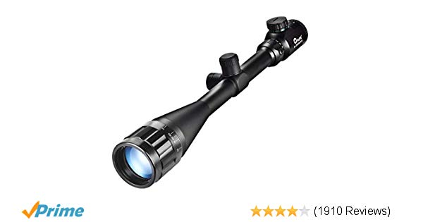
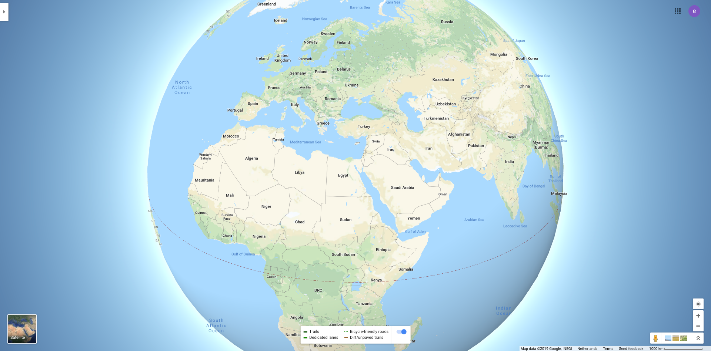
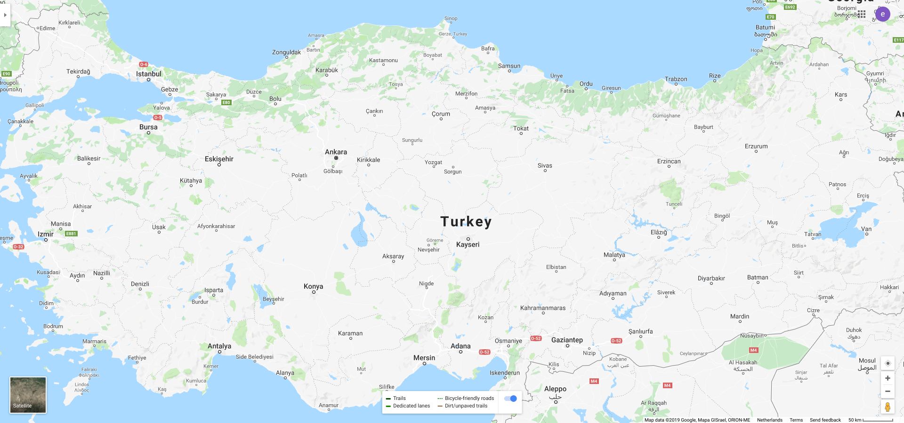
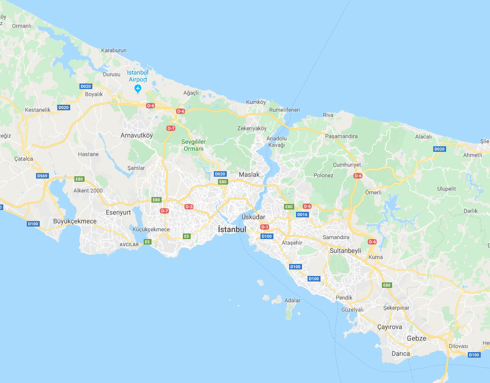

Let us talk about scope first.
Scope is a mechanism in computer science to hide level of detail and localize it. What does this mean exactly ?

Think of a google maps. If we think of zoom as a scope,



This is our global scope.



When we are running our javascript in the browser, it is running at the global scope. At the global level, only information relatvent to the globe is visible, country names, ocean names etc. The map does not try to view every street name at the global zoom level, it is irrelevant and if it did try to that it would be unusuable. Think about it, there won't be enough space for the text.

If you search on google maps for Turkey, the result will zoom in from the global view to where you can see Turkey as whole. It does not show you other countries, just Turkey.



Additionally you will see that you can also see the names of the cities. Only the big ones. The map shows you the information that it thinks is relevant. It does not pollute your view, with all of the information it has.



Lets zoom in to the map, for example to Istanbul. Suddenly we start to see the names of the neighbourhoods, aveneues etc. The map already has information about all these places when you first searched for Turkey, but they are not relevant. Seeing all this information would pollute the view and will make it harder for you to locate what you are searching for.

The zoom (scope) of the map also provides us with a context. If we are searching for a streetname in Istanbul, Turkey, we do not want to search the rest of the globe. This prevents us to find the streets that have the same name in different cities in Turkey.

```js
// Global scope here
const oceans = ['Pacific', 'Atlantic', 'Indian', 'Southern', 'Arctic'];
var name = 'Global';
function imf() {
  var name = 'International Monetary Fund';
  return name;
}

function Turkey() {
  var name = 'Turkiye';
  var nationalFootballTeam = 'Milli Futbol Takimi';
  function Istanbul() {
    var name = 'Istanbul';
    return name;
  }
  Istanbul();
  return name;
}

function Netherlands() {
  var name = 'Nederland';
  var nationalFootballTeam = 'Nationaal Voetbalteam';
  function Amsterdam() {
    var name = 'Amsterdam';
    return name;
  }
  Amsterdam();
  return name;
}
imf();
Turkey();
Netherlands();
console.log(name);
```

This will return

```js
'International Monetary Fund';
'Istanbul';
'Turkiye';
'Nederland';
'Amsterdam';
'Global';
```

Here is an image from google maps. When you zoom out the maximum amount, it only shows the country names. This is exactly how the javascript global scope works, done. Thanks for reading.

I am kidding, we barely started. If we think of the zoom of the map as scope, each zoom has its own scope. At the global scope, we see only the countries.

```js
var firstName = 'Emil'; // variable declaration
var lastName = 'Martinov'; // variable declaration
function myFullName(firstName, lastName) {
  // function declaration and the parameters, firstName and lastName
  return firstName + lastName; // returning the arguments !!
}
console.log(myFullName(firstName, lastName)); //logging the return of myFullName
```

When I first saw code like this the first time, it was very confusing for me, seeing firstName here, firstName there and the last line. I did not understand seperation of all these same named values.

From mathematics background I could guess that function is a placeholder for instructions, that values firstName, lastName are placeholders for what we might put into that function so that the function follows the recipe inside.

Let's take a look at what happens at that code snippet.

```js
var firstName = 'Emil'; // variable declaration
var lastName = 'Martinov'; // variable declaration
```

- We define our variables firstName and lastName.

```js
function myFullName(firstName, lastName) {
  // function declaration and the parameters, firstName and lastName
  return firstName + lastName; // returning the arguments !!
}
```

- Then we declare our function `myFullName`. Inside the paranthesis `()`, we are creating placeholders `firstName` and `lastName`, these placeholders only exist inside our function. Think of the function declaration as a cooking recipe, and the placeholders, parameters in programming language, are our ingredients. After we tell the function its instruction `return firstName + lastName`, we are done with our recipe so we close `}` the curly bracket.

- Now we just finished writing the recipe, but we have not done anything with it. So at this time it is just a piece of paper with some instructions.

```js
myFullName('Emil', 'Martinov'); // here we use the function
// it will return 'EmilMartinov'
```

- We are calling the function. The name of the function followed with `()` is telling javascript engine that we want to call the function and let the recipe do some work. The `'Emil'` and `'Martinov'` are the ingredients that we use with the recipe. Since we are using our recipe function now, these are called arguments. Remember in the recipe itself they are called parameters. This small distinction is made so when we speak about functions we can communicate exactly what we are talking about to our colleagues.

When we are talking about parameters we are talking about the moment we are defining our function recipe. Those are placeholders. When we are talking about arguments, we are talking about calling the function. The arguments are the values that replace the parameters.
