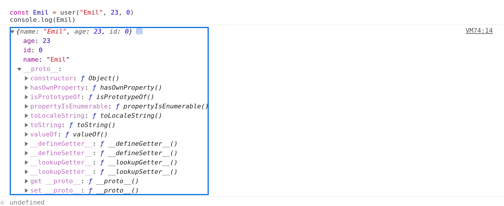
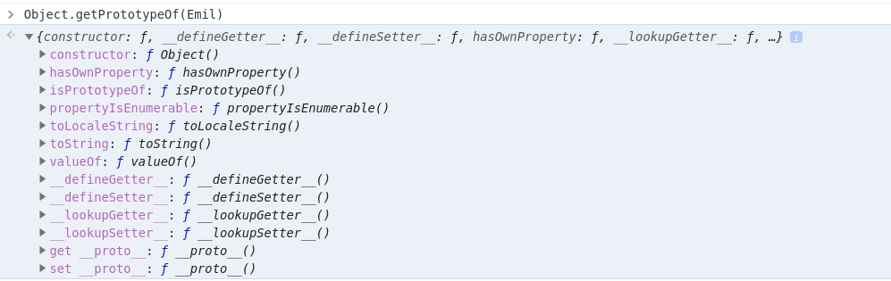

Requirements: this, passed by reference, passed by value, objects, functions

Javascript is free spirit, you can code object oriented and in functional style. When we talk about object oriented, it means we provide a solution through using objects. 


One of the most common places that we use objects is defining users for a website.

```javascript
const user = {}
// let us add properties with dot notation
user.name = "Emil";
user.age = 23;

// let use also create a unique user id, 
// so we can distinguish two users with the same name

user.balance = 50; // our first user starts at 0

// Let us create another user, this time with object syntax

const user2 = {
    name: "Liam",
    age: 10,
    balance: 0
}

user.name // "Emil"
user2.name // "Liam"
// both dot notation and object syntax is equivalent here
```

What if we try to create thousands of users. We can let a function, our favorite javascript worker, do the work for us. 


```javascript
// we will reassign to user, that is why I have used let. 
// Otherwise I would have chosen const as we do not want to reassign it. 

// We want our function to build our object,
// so we will feed the data as arguments.
let user = function(name, age, balance){
    // we create an object to store this information
    const newObject= {} 
    // we can also use Object.create(null) to strip away, 
    // Object.prototype connection. 
    // Why we might do this, will be clear later on.
    newObject.name = name;
    newObject.age = age;
    newObject.balance = balance;
    // since we are using a function, we need to return this value, 
    // otherwise functions return undefined by default.

    return newObject;
}


let Emil = user("Emil", 23, 50)
console.log(Emil)
// {name: "Emil", age: 23, balance: 50}
let Liam = user("Liam", 10, 0)
console.log(Liam)
// {name: "Liam", age: 10, balance: 0}
```



Emil here is an instance(result of the invocation at that moment) of user function. So if user is the parent, Emil would be the child. 

We can see that a __proto__ property is attached to our newly object. This property keeps a reference to the parent's prototype object. 

**NOTE:** 
- `Keeps a reference` means it points to another direction. If you are confused about what a reference is, please check my other blog post.

- What is the prototyoe object ? The prototype object is a special object, where created functions/objects store methods that are shared by all created functions/objects. Just like Object.prototype.toString(). Every object has access to it, as every object is created by Object.


What is a constructor though (see the image)? When we call a function  (invoking a function) or creating an object by using object literal (`{}`), a **constructor** function creates, **constructs**, the function/object. This function is referenced by __proto__.constructor.

```javascript
Object.getPrototypeOf(Emil)
```


When we ask for the prototype of Emil, we get the object referenced by __proto__. Above we can see that constructor of Emil object is the Object constructor (capital letter, which refers to the parent of all objects). The reason for this is, we used object literal `{}` to create our function inside user function. The user function just returned the value. 

We are getting somewhere, but now for each user we need to increment the id by 1. We can do better, by making a function do the work for us. For our server, we need a counter for the id, and we need a function that will increment the id whenever a user is created.

```javascript 
 let user = function(name, age, balance){
    const newObject= {} 
    newObject.balance= balance;
    newObject.name = name;
    newObject.age = age;
    newObject.earn = function(){
        return ++newObject.balance; 
        // id++, return value as is, then increment it by 1
        // ++id, increment the id by 1, then return (value+1) 
    }
    newObject.id = newObject.getId();

    return newObject;
}


let Emil = user("Emil", 23, 0)
console.log(Emil)
// {name: "Emil", age: 23, id: 0, getId: ƒ}
let Liam = user("Liam", 10, 1)
// {name: "Liam", age: 10, id: 1, getId: ƒ}
```

One step closer. Now our function is doing the work, but we have 2 functions created. Let us try to extract that function. But here is a problem

```js
let id =0;

let getId = function(){
    return id++;
}
let user = function(name, age, id){
    const newObject= {} 

    newObject.name = name;
    newObject.age = age;
    newObject.id = getId();

    return newObject;
}
```


The newly created function/object keeps a reference to who created it, with constructor property on __proto__ reference. This is useful because the created function/object inherits methods from the parent. 

Think of it as family relations. When my son Liam was born, he automatically inherited some privileges. Although he could not directly buy what he wanted, he could easily call the buy function from his father, by crying out loud. 

__proto__ is a reference to another objects prototype ? It is confusing right? Naming is one of the hardest parts of programming. The reason we have 2 properties is, everyobject can have its own prototype. 